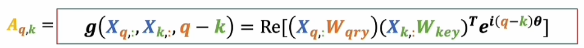

# Attention mechanism
## 编码解码
> 通过大量文本的上下文确定词与词之间的关系，例如“香蕉”这样的词，无论是在怎样的语言体系里，都是与“猴子”、“黄”、“水果”这样的词关系更加密切。

**“码”**：针对机器翻译的问题，这里的码，可以抽象为将各种语言中符号、发音等形式上的不同剥离之后，剩下的纯粹的语义关系。这里的码一定具有如下的特点：

- 1.数字化的（可以被计算机处理）；
- 2.需要表示语义之间的相互关系；
例如，将所谓的“码”表示为高纬空间中的坐标，各个词（点：“基础语义单元”、token）之间的距离，则可以表示词之间语义关系的精密程度：

## 将矩阵运算看作空间变换

如图，将(a,b)转换为T向量，其中**转换矩阵的行数代表旧坐标系的维度，列代表了新坐标系下的维度**，但注意到，这种所谓的空间变换是相对的，坐标系和向量的角色可以互换。**左乘W矩阵，可以看做将一个原空间以及原空间内的所有向量、矩阵集合映射到新的空间内** 

## 嵌入 embeding
将原始的数据单元（例如NLP中的token、CV中的patch或者pixel）进行“降维”，通过嵌入矩阵将其映射到一个低维空间中（潜空间、嵌入空间），这个低纬空间具有更抽象更纯粹的语义，并能表示出token之间的关系。构建出这样连续的潜 空间之后，即使遇到新的token，也能通过计算其与已有token的关系来确定其语义。

## 注意力机制

(以NLP问题为例，这是一个自注意力机制)
### 注意力解决的问题：
大量的上下文token被嵌入矩阵映射到嵌入空间中后，得到大量的“词向量”，这些词向量组合起来得到Din,此时Din中所有的词向量都具有基本的、**客观的词义**（在其语言环境下）；通过词向量上下文的组织关系（词矩阵）本身，可以获得一些**主观的、可解释的语义**，而这些主观性的语义，则是**通过上下文关联从客观的语义空间调整、约束、抽取出来的，而这一过程，则通过注意力机制来实现**。 
- **V**:将嵌入空间中的词矩阵进行进一步空间变换，进而构成**面向当前上下文的客观语义空间**。
- **Q**：在逻辑上将其看作“设定语义”，为上下文表达进行语境设定的语义。
- **K**：在逻辑上则将其在设定好的语境下倾向表达观点的主观内容，及“表达语义”
> 这里的Q和K所表示的含义应该是相对，QK相乘得到的A，则是计算在上下文环境中每个token所谓“设定”和“表达”的匹配度，由后续的计算可以看到，**当这里两个词向量所谓的“匹配度”更高使，  那么对应的，V中词向量在对应的维度上值收到的影响就会更大，也就会更“关注”相应对向量的对应维度**
- **A**: 由词矩阵上下文关联而产生的原始修改系数，Q、K矩阵内两两向量之间计算内积，即Q内一个词向量在K内词向量上的投影，得到的结果是一个矩阵A，A矩阵的每一行代表了当前词在上下文中的相似度，**A矩阵的每一个元素代表了当前词在上下文中的关系，也称作注意力得分（对于Aij，即代表词向量i与词向量j之间的关系得分，自注意力机制下，Aii同理）**

- **A'**:A矩阵通过softmax对A矩阵进行归一化。 

- **A'与V相乘**：
    
将A'作为一个修正矩阵，与V相乘。具体来看，对于Dout中的Doutij，是将V中的第i个词向量在j个维度上的值进行调整（调整的方法则**是通过当前上下文上所有词在第j个维度上对当前第i个词向量的j维产生影响，产生影响的大小则通过A'xij因子来修正**）得到的结果是**当前上下文的注意力加权的词向量**，即**当前上下文的语义表示**，这也是自注意力机制的最终输出。
### 为什么直接训练A，而是通过训练QK再相乘得到V:

直接训练权重矩阵WA得到A，本质上是对原本嵌入空间的词矩阵做线性变化（直线的版本，在这种情况下，输入输出是一个一对一的关系）。而通过训练QK再相乘得到A，则通过训练两个矩阵**引入了一些非线性要素**，这在**形式上更趋近一个二次型**，则可以实现更复杂的性能，让模型可以表达embeding之间的更复杂的关系。

 ### 交叉注意力机制
 
 Q由一组上下文词矩阵得到，在逻辑上理解，则类似已有了对应的设定语义（就像一本参考书，或者期望从另一个上下文主观下的设定中学习当前上下文的表达，在翻译问题中，Transformer的解码器段就是通过交叉注意力机制校准解码器段的上下文关系，从而生成相应的翻译结果）

 ### 位置编码
 > 按上述的过程理解，词向量在其组成的词矩阵中的顺序是不对计算和学习的过程产生影响的（即，词矩阵中每一行的向量调换位置后，不影响计算出的A的大小，也不影响A和V相乘所代表的意义）

 
 **位置编码的解决的核心问题是在词向量后续进行并行计算的同时，体现他们先后的位置顺序**。两种方法：
 - 1. 偏执系数相加：将位置编码的偏执矩阵与词向量矩阵进行相加，得到新的词向量（Transformer）。
  
 - 2. 阿达玛乘积：将位置编码权重矩阵与词向量矩阵进行逐项相乘，得到新的词向量，这样做，可以放大词向量的位置信息对上下文产生的影响，而且直接使得不同维度的语义信息和其绝对位置强相关。
    

#### 相对位置编码
在QK转置相乘得到A时，通过位置编码矩阵，可以引入原始上下文的式位置信息。原始的位置编码表达的是某一词向量在陕峡谷i文中的绝对位置信息，如下图：

可以看到，后三个矩阵，都和词向量的绝对位置信息相关，但是是实际上，我们可能期望计算两个词向量的匹配度时，考虑他们之间的相对位置，及i-j距离，而不是绝对位置。则，需要针对上式中的后三项重新构造函数：

在阿达玛乘法的形式下，有：

### 多头注意力机制
