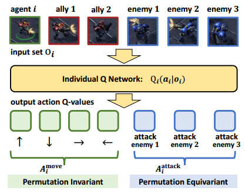
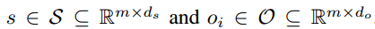
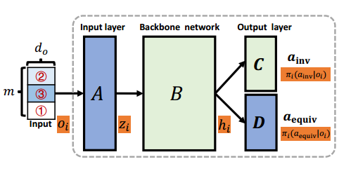
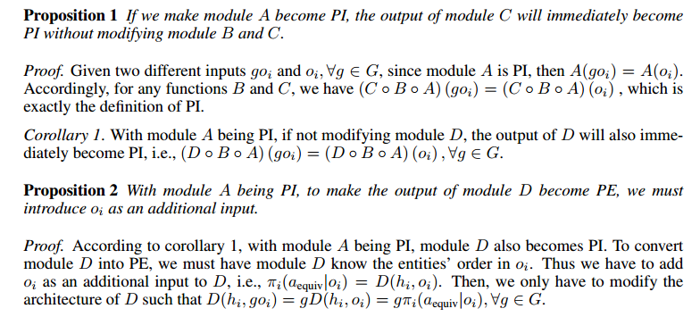
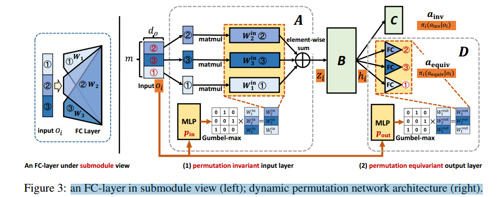
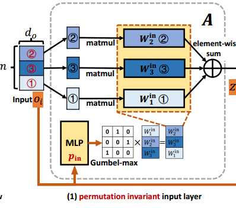
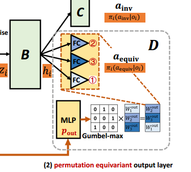

# PYMARL3 论文笔记

## 研究背景

- 问题：随着智能体数量增加，状态空间复杂度呈指数级增长，导致算法可扩展性差、样本效率低下。**【维度灾难】**

### 已有研究：

> Permutation invariant policy optimization for mean-field multi-agent reinforcement learning: A principled approach

合理缩减 状态-动作空间的规模

### 置换不变性（PI）与置换等变性（PE）

**置换矩阵（Permutation Matrix）**：  
置换矩阵是每行和每列仅有一个元素为1，其余为0的方阵。其作用是对向量的元素进行重新排列。例如，若输入向量为 \( X = [x_1, x_2, \ldots, x_m]^\top \)，置换矩阵 \( g \in G \) 作用于 \( X \) 后，得到的新向量是原向量的某种排列，如 \( [x_2, x_1, \ldots, x_m]^\top \)。

---

**PI函数（Permutation-Invariant Function）**  
- **定义**：输入向量的任何置换均不改变函数输出。即对于任意置换矩阵 \( g \in G \)，有  
  \[
  f(gX) = f(X), \quad \text{其中 } X = [x_1, \ldots, x_m]^\top.
  \]
- **特点**：输出与输入元素的顺序无关。  
- **示例**：  
  1. **标量输出**：求和 \( f(X) = \sum_{i=1}^m x_i \)、均值、最大值等。  
  2. **向量输出**：若每个输出元素为输入的全局特征（如所有元素的均值），则输出向量不随输入置换改变。

---

**PE函数（Permutation-Equivariant Function）**  
- **定义**：输入向量的置换会同步置换输出。即对于任意置换矩阵 \( g \in G \)，有  
  \[
  f(gX) = gY, \quad \text{其中 } Y = [y_1, \ldots, y_m]^\top = f(X).
  \]
- **特点**：输出的排列与输入的排列完全一致。  
- **示例**：  
  1. **逐元素操作**：如 \( y_i = 2x_i \) 或 \( y_i = \text{ReLU}(x_i) \)。  
  2. **恒等函数**：输出与输入完全相同，即 \( f(X) = X \)。

---

**置换敏感函数（Permutation-Sensitive Function）**  
- **定义**：既非PI也非PE的函数。输入的置换会导致输出的非同步变化或结构改变。  
- **示例**：  
  1. **局部依赖操作**：如 \( y_i = x_i + x_{i+1} \)（边界需特殊处理）。  
  2. **固定顺序操作**：如将输入排序后输出（此时输出顺序固定，与输入置换无关，属于PI函数的反例）。  
  3. **部分置换敏感操作**：仅处理输入的某部分（如前 \( k \) 个元素），置换后输出可能不匹配输入置换。

---

**关键区别**  
| 类型              | 输入置换对输出的影响                     | 输出结构              |
|-------------------|------------------------------------------|-----------------------|
| **PI函数**        | 输出完全不变                             | 标量或全局一致性向量  |
| **PE函数**        | 输出同步置换                             | 与输入同维度的向量    |
| **置换敏感函数**  | 输出变化与输入置换无明确关系             | 任意形式              |

---

**数学性质对比**  
- **PI函数**：满足 \( f(gX) = f(X) \)，体现对称性下的不变性。  
- **PE函数**：满足 \( f(gX) = g \cdot f(X) \)，体现对称性下的等变性。  
- **置换敏感函数**：不满足上述任一条件，可能破坏对称性。

---

### 利用PI与PE降低多智能体环境中观测空间复杂度：

多智能体环境通常由m个独立实体构成，其中包括n个学习智能体与m−n个非玩家对象。每个智能体i的观测值oi通常由这m个实体的特征组成，即[x1, ... xm]，其中xi∈X表示每个实体的特征，X为特征空间。若简单地将oi表示为[x1, ... xm]按固定顺序的拼接，观测空间将达|X|m。
先验知识表明：**尽管这些实体存在m!种不同的排列顺序，但它们本质上包含相同的信息**。因此构建对实体顺序不敏感的函数，可将观测空间显著降低至原空间的1/m!。

如图，以IQL为例，对于动作输出的move维度，输入的顺序变换应不影响输出的值，故而可以采用PI架构实现高效学习；对于attack维度，输入的敌方观测的排序应和输出的攻击目标排序一致，应使用PE架构提升Qi学习效率。

### 实现PI的几类方法（实现PE的较少）：
#### 一、基于数据增强：**数据增强的MADDPG**:
打乱输入组件的顺序生成更多的训练数据，并强制通过训练将这些数据映射至相同输出。
**缺点**：原函数是排列敏感的，训练一个排列敏感函数使其在不同特征顺序下输出相同值效率极低。
#### 二、天然满足PI特性： 深度集合与图神经网络等
通过**共享输入嵌入层**和实际级池化层来实现排列不变性。
**缺点**：使用共享嵌入层会限制模型的表征能力，可能导致性能下降
#### 三、多头自注意力与Transformer
**限制**：UPDeT将Transofme引入MARl,但专为迁移学习设计，并未显示考虑PI与PE的特性

>  **MARL中的PE函数**:深度学习领域已有研究探讨PE函数在图结构问题中的有效性（Maron等，2018；Keriven&Peyré，2019），但在MARL中鲜有相关研究。动作语义网络（Wang等，2019）虽研究了不同类型动作的差异性影响，但未直接考虑PE特性。

---

## 本文方法——DPN+HPN:
pymarl3 提出了两种创新实现方案：**动态置换网络（Dynamic Permutation Network, DPN）和超策略网络（Hyper Policy Network, HPN）。**
为实现排列不变性（PI），DPN构建了一个独立的模块选择网络，该网络始终为同一输入实体选择相同0的输入模块（无论实体位置如何排列），并通过求和池化合并所有输入模块的输出。
为实现排列等价性（PE），DPN构建了第二个模块选择网络，其始终将相同输出模块分配给同一实体相关输出。然而DPN存在一个限制：网络模块数量有限，导致分配给每个实体的模块可能并非最优匹配。为解除这一限制并增强表征能力，我们进一步提出HPN方案——用超网络取代DPN的模块选择网络，直接生成对应模块的网络参数（以各实体自身特征作为输入）。具有不同特征的实体将由参数专属于该实体的模块进行处理，从而在保证PI与PE特性的同时提升了模型的表征能力。

### 因子化空间
> 在因子化空间中对多智能体强化学习（MARL）进行建模是一种常见做法。许多近期研究（Qin等，2022；Wang等，2020b；Hu等，2021b；Long等，2019；Wang等，2019）将典型MARL基准测试（如SMAC（Qin等，2022；Hu等，2021b）、MPE（Long等，2019）和Neural MMO（Wang等，2019））中的观测值与状态，分解为与环境、智能体自身及其他实体相关的因子化组成部分。

在因子化空间中对多智能体强化学习（MARL）进行建模是指将复杂的状态和观察空间分解为与特定实体相关的低维特征组合，而非将其视为单一高维整体。这种分解基于环境中存在的实体（如智能体、非玩家对象等），每个实体的状态或观察被表示为独立的因子（feature）。例如，在SMAC或MPE等多智能体环境中，智能体的观察可能包含自身状态（位置、血量等）、环境信息（地形、目标点等）以及其他实体的信息（队友或对手的位置、动作等）。这种分解能够降低模型复杂度，提升学习效率，并更好地处理部分可观测性问题。

**“其他实体相关的因子化部分”** 特指分解后与当前智能体无关的其他实体（如其他智能体、中立对象、敌方单位等）对应的特征。例如，在星际争霸（SMAC）场景中，一个智能体的观察可能包含自身状态因子、环境因子，以及队友和敌方单位的因子（如它们的坐标、血量或动作）。这些因子通过注意力机制、图神经网络或参数共享等方式整合，以建模实体间的交互关系。其核心目标是通过显式分离不同实体的信息，增强模型对局部与全局关系的理解能力，从而更高效地协作或竞争。

#### 实体特征的进一步分解
**状态空间**：PYmarl3 进一步将状态空间与观测空间均分解为相关实体特征：
**动作空间**：每个智能体的动作由两类组成：
 - 一组m个实体关联动作 $\mathcal{A}_{\mathrm{equiv}}$
 - 一组实体无关动作$\mathcal{A}_{\mathrm{equiv}}$

即  $\mathcal{A}_{i}\triangleq(\mathcal{A}_{\mathrm{equiv}},\mathcal{A}_{\mathrm{inv}}).$

 **实体关联动作意味着每个实体与每个动作间存在一一对应关系，例如《星际争霸》微操场景中的"攻击哪个敌人"或足球游戏中的"传球给哪位队友"**。因此，$\mathcal{a}_{\mathrm{equiv}}$ ∈ $\mathcal{A}_{\mathrm{equiv}}$  应具有对oi排列的等变性，而 $\mathcal{a}_{\mathrm{inv}}$ ∈ $\mathcal{A}_{\mathrm{inv}}$ 则应具有不变性。

 ### 结构与理论
任意的置换矩阵g,使得
 - g(oi)表示对m个实体特征顺序进行置换;
 - g($\mathcal{a}_{\mathrm{equiv}}$,$\mathcal{a}_{\mathrm{inv}}$) 表示对$\mathcal{a}_{\mathrm{equiv}}$顺序置换，但是保持 $\mathcal{a}_{\mathrm{inv}}$ 不变。

**将PI与PE特性统一到一个网络中**，使其满足:
$\pi_i(a_i|go_i)=g\pi_i(a_i|o_i)\triangleq(g\pi_i(a_\mathrm{equiv}|o_i),\pi_i(a_\mathrm{inv}|o_i))\quad\forall g\in G,o_i\in\mathcal{O}$

其中，**g作用于$\pi_i$,是通过 $\pi_i(a_\mathrm{еquiv}|o_i)$的顺序进行置换，但同时保持$\pi_i(a_\mathrm{inv}|o_i)$不变。**

目标策略网络结构如图所示，A代表了输入模块，B代表了可以采用任意架构的主干网，C负责输出$\mathcal{a}_{\mathrm{inv}}$，D负责输出$\mathcal{a}_{\mathrm{equiv}}$。
**DPN提出将A改造为PI，D改造为PE**

> 
> 文章提出的两个命题

该方法保证**智能体决策网络主干部分B与输出部分C的不变，采用最小修改原则**。

### DPN(dynamic permutation network)

#### 1. 设计目标
• 输入层置换不变性（PI）：无论输入实体（如友方/敌方单位）的排列顺序如何变化，网络对同一组实体的编码结果应保持一致。

• 输出层置换等变性（PE）：输入实体的排列顺序改变时，网络输出的实体相关动作（如攻击目标）的顺序应同步变化，但内容保持一致。
#### 2. 实现机制
##### 输入层的PI设计
1. 传统全连接层的局限性：
   • 输入特征按固定顺序拼接为向量，权重矩阵与位置绑定。若输入顺序改变（如交换两个敌方单位的位置），同一实体的权重矩阵位置会变化，导致输出不同，破坏PI。

2. 动态模块选择：
   • 引入模块选择网络（公式4），为每个实体特征 \( o_i[j] \) 动态选择对应的权重矩阵。

   • 流程：

     1. 对每个实体特征 \( o_i[j] \)，通过MLP生成权重矩阵选择的概率分布：  
        \[
        p_{\text{in}}\left(\left[W_{1}^{\text{in}},\ldots W_{m}^{\text{in}}\right] \mid o_i[j]\right) = \text{softmax}(\text{MLP}(o_i[j]))
        \]
     2. 通过Straight Through Estimator选择概率最高的权重矩阵，确保相同实体特征始终选择同一权重（公式5）：  
        \[
        z_i = \sum_{j=1}^{m} o_i'[j] \left( \hat{p}_{\text{in}}(o_i'[j]) \mathcal{W}_{\text{in}} \right)
        \]
   • 关键点：选择仅依赖实体特征本身，而非输入位置，从而保证PI。

   

##### 输出层的PE设计
1. 输出动作的等变性要求：
   • 若输入敌方单位顺序交换，攻击动作的概率分布应同步交换（如原第2个敌方对应的攻击动作变为第1个）。

2. 动态输出模块选择：
   • 对每个输出位置 \( j \)，通过模块选择网络生成权重矩阵（公式6）：  

     \[
     \pi_i(a_{\text{equiv}} \mid o_i')[j] = h_i \left( \hat{p}_{\text{out}}(o_i'[j]) \mathcal{W}_{\text{out}} \right)
     \]
   • 关键点：输出权重矩阵与输入实体一一绑定，输入顺序变化导致输出顺序同步变化，实现PE。

#### 3. 数学形式化
• 输入层PI：  

  \[
  z_i = \sum_{j=1}^{m} o_i'[j] \left( \hat{p}_{\text{in}}(o_i'[j]) \mathcal{W}_{\text{in}} \right), \quad o_i' = g o_i, \forall g \in G
  \]
• 输出层PE：  

  \[
  \pi_i(a_{\text{equiv}} \mid o_i')[j] = h_i \left( \hat{p}_{\text{out}}(o_i'[j]) \mathcal{W}_{\text{out}} \right), \quad o_i' = g o_i, \forall g \in G
  \]

#### 4. 优势与局限性
- 优势：

  通过动态选择模块，显式保证PI/PE，降低状态空间复杂度。

  兼容现有MARL算法（如QMIX、VDN），仅需修改输入/输出层。

- 局限性：

  模块数量有限（\(|\mathcal{W}_{\text{in}}| = m\)），可能无法为复杂实体分配最优权重。

  模块选择网络需额外训练参数，增加模型复杂度。

### HPN（Hyper Policy Network）

HPN（超策略网络）通过动态生成权重矩阵替代DPN的固定模块选择，解决了DPN的表示能力限制。其核心是利用超网络（Hypernetworks）为每个实体生成定制化参数，同时保证置换不变性（PI）和置换等变性（PE）。

#### 1. **超网络（Hypernetworks）的作用**
超网络是一个生成其他神经网络参数的模型。在HPN中：
输入：每个实体的特征向量（如敌方单位的坐标、血量等）。

输出：生成对应实体的权重矩阵，用于嵌入或动作预测。

优势：避免固定模块数量的限制，实现“无限”参数适配不同实体。

#### 2. **输入层的置换不变性（PI）实现**
• 步骤：

  1. 超网络生成嵌入权重：  
     对每个实体特征 \( o_i[j] \)，通过超网络生成其专属的嵌入权重矩阵：
     \[
     \mathcal{W}_{\text{in}}[j] = \text{MLP}(o_i[j])
     \]
     （超网络输出被重塑为 \( d_o \times d_h \) 的矩阵，\( d_o \) 为输入维度，\( d_h \) 为隐藏层维度）
  2. 独立嵌入每个实体：  
     每个实体特征 \( o_i[j] \) 乘以其对应的权重矩阵，得到嵌入结果：
     \[
     e_j = o_i[j] \cdot \mathcal{W}_{\text{in}}[j]
     \]
  3. 求和池化（Sum Pooling）：  
     所有实体的嵌入结果相加，得到输入层输出：
     \[
     z_i = \sum_{j=1}^m e_j
     \]
• PI保证：无论输入顺序如何变化，相同实体的权重矩阵唯一，求和操作与顺序无关。

#### 3. **输出层的置换等变性（PE）实现**
• 步骤：

  1. 超网络生成动作权重：  
     对每个实体特征 \( o_i[j] \)，超网络生成对应的输出权重矩阵：
     \[
     \mathcal{W}_{\text{out}}[j] = \text{MLP}(o_i[j])
     \]
  2. 动态生成动作分布：  
     隐藏层特征 \( h_i \) 与每个实体的输出权重相乘，得到对应动作的Q值：
     \[
     \pi_i(a_{\text{equiv}} \mid o_i')[j] = h_i \cdot \mathcal{W}_{\text{out}}[j]
     \]
• PE保证：输入顺序变化时，生成的权重矩阵顺序同步变化，导致输出动作顺序相应变化。

#### 4. **HPN与DPN的关键区别**
| 特性          | DPN                          | HPN                          |
|--------------------|----------------------------------|----------------------------------|
| 参数生成方式   | 从固定模块集合中选择权重矩阵      | 超网络动态生成权重矩阵            |
| 表示能力       | 受限于模块数量（如m个）           | 理论上无限，适应复杂实体特征      |
| 灵活性         | 依赖模块选择网络，可能次优        | 实体特征直接驱动参数生成，更适配  |
| 训练复杂度     | 需训练模块选择网络                | 超网络参数与主网络联合优化        |

#### 5. **HPN的优势**
增强的表示能力：实体特征动态生成参数，避免共享嵌入层的限制。

严格的PI/PE保证：权重生成与实体绑定，数学上保证对称性。

泛化性：适应实体数量变化，天然支持多任务和迁移学习。

实验表现：在SMAC等基准中实现100%胜率，显著优于DPN及传统方法。

#### 6. **示例说明**
假设战场中有3个敌方单位，特征分别为 \( o_1, o_2, o_3 \)：
1. 输入处理：  
   • 超网络为每个 \( o_i \) 生成唯一权重矩阵 \( W_i \)。

   • 计算 \( e_1 = o_1W_1, e_2 = o_2W_2, e_3 = o_3W_3 \)，求和得到 \( z = e_1 + e_2 + e_3 \)。

2. 输出动作：  
   • 超网络生成攻击权重 \( W'_1, W'_2, W'_3 \)，计算每个敌方对应的Q值。

   • 若输入顺序变为 \( o_2, o_3, o_1 \)，输出Q值顺序同步调整为对应敌方。