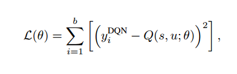
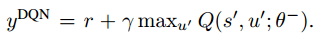
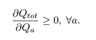
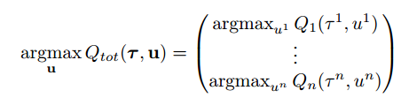
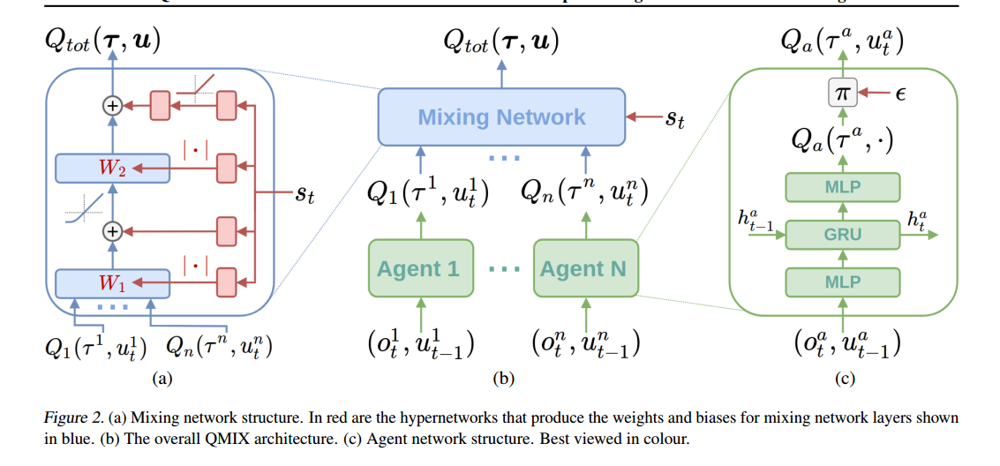
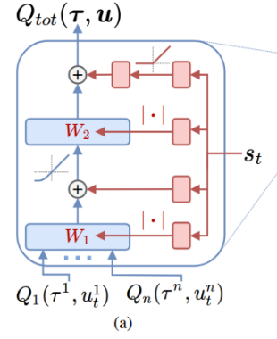
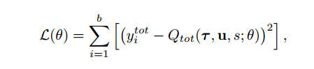
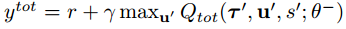
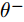

 # QMIX 论文笔记
## 研究背景
在模拟或实验环境中以集中方式训练agent，在这种环境中，**全局状态信息可用，无通信约束。在这种环境下，集中式学习/训练：多智能体系统**可以学习到基于额外信息的联合动作价值。（但是不知道如何提取分布式/分散式策略）
**QMIX**：采用一种网络将每个智能体的价值（V,基于局部观测）进行复杂非线性组合，估计出所谓联合价值。
**前提**：结构上确保了联合行动价值在单智能体价值中的单调性，以保证在**离线策略学习**中，能够有效地最大化联合行动价值。保证了集中式策略与分散式策略之间的一致性（？）

**背景**：部分可观测性和/或通信限制使得必须学习分散式策略，这些策略仅基于每个智能体的局部行动-观测历史进行决策。分散式策略也自然地缓解了联合行动空间随智能体数量呈指数增长的问题，而这一问题常常使得传统单智能体强化学习方法的实际应用变得不可行。

**挑战**：如何表示和利用大多数强化学习方法所学习的动作价值函数。一方面，准确捕捉智能体行为的影响需要一个集中式的动作价值函数Qtot，该函数基于全局状态和联合动作进行条件化。另一方面，当存在多个智能体时，这样的函数难以学习；即便能够学习，也缺乏明确的方法来提取分散策略，使得每个智能体仅能根据个体观察选择单一动作。

### **已有研究**：
- **独立Q学习（IQL）**：放弃集中式的动作价值函数，让每个智能体a独立学习一个个体动作价值函数Qa。
    - 缺陷：无法明确表示智能体之间的交互，并且可能无法收敛，因为每个智能体的学习会受到其他智能体学习和探索的干扰。 
- **反事实多智能体（COMA）**：另一个极端，学习一个完全集中式的状态动作价值函数Qtot，然后利用它在一个演员-评论家框架中指导分散策略的优化。
    - 缺陷：需要在线学习，可能样本效率低下，并且当智能体数量较多时，训练完全集中式的评论家变得不切实际。 
- **VDN**：在这两个极端之间，可以学习一个集中但分解的Qtot。通过将Qtot表示为仅基于个体观察和动作的个体价值函数Qa的总和，分散策略自然地从每个智能体根据其Qa贪婪地选择动作中产生。损失函数参考：

其中，VDN使用Qtol代替Q,
    - 缺陷：严重限制了可表示的集中式动作价值函数的复杂性，并**忽略了训练期间可用的任何额外状态信息**。

 ## QMIX约束：
 需要保证在Qtot上执行的全局argmax操作与在每个Qa上执行的一系列单独argmax操作产生相同的结果。为此，需在Qtot与每个Qa之间的关系上施加单调性约束：
 
 具体来说，QMIX通过限制**混合网络具有正权重**来强制执行约束条件
 QMIX依赖于一个神经网络，以类似于超网络（Ha等，2017）的方式，将集中状态转换为另一个神经网络的权重。通过保持其权重为正，这第二个神经网络被约束为相对于其输入是单调的。

 **CTDE**:训练过程是集中化的，执行却是分散化的，即学习算法能够访问所有局部行动-观察历史τ和全局状态s，但每个智能体学习到的策略仅能基于其自身的行动-观察历史τa进行条件化。

 ## QMIX方法：
要提取与集中式策略完全一致的分散策略，并不需要如同VDN的完全因子分解，为了保持一致性，***QMIX只需要确保在Qtot上执行的全局argmax操作与在每个Qa上执行的一系列单独argmax操作产生相同的结果**。（CT与DE的一致性）

> IGM 条件

QMIX认为，只要Qtot对Qa单调非线性，即满足上述条件。（充分不必要，可能过度约束，牺牲了部分解空间，换取可实现性）

混合网络是一种前馈神经网络，它以智能体网络的输出作为输入，并对其进行单调混合，生成Qtot。为了保证单调，混合网络的权重（不包括偏置）被限制为非负（**这意味着图（a）中的网络结构任意地逼近任何单调函数**）.
- 混合网络**权重由一个单独的超网络生成**，每个超网络以全局状态s作为输入，通过一个单一的线性层，后接一个绝对值激活函数（保证输出为非负），最后输入混合网络一层的权重向量。最后这个向量再reshape为适当大小的矩阵。
- 偏置以相同的方式产生，但不使用绝对值激活函数。
- 最终偏置由一个具有ReLU非线性的两层超网络生成。

###  如何在保证单调混合的同时，兼顾全局信息与局部观察？
将全局状态信息state作为超网络的输入，并不直接输入混合网络，这样可以实现Qtot以非单调的形式依赖state信息。利用超网络可以使我们以任意方式将单独网络的权重依赖于状态s上，从而将s整合在联合动作的价值函数Qtot中。

### 损失函数

b是从回放缓冲区中采样的批次大小，，其中，是目标网络中的滞后参数。

### QMIX无法解决的问题
> Intuitively, any value function for which an agent’s best action depends on the actions of the other agents at the same time step will not factorise appropriately, and hence cannot be represented perfectly by QMIX.

当在某一时间步长内时，agent的最佳动作依赖于qt的其他智能体的动作时，其价值函数都合理地分解。QMIX无法完美表示这一类函数，但近似程度>VDN。

## 一些思考总结：
**QMIX的motivation**: 在保证单调混合的同时(尽力满足IGM条件并使得可以求解)，兼顾全局信息与局部观察.

值分解/creidt分配问题的两种类型：
1. **自上而下类型**：这种类型通常指我们只能拿到一个团队的最终得分，而无法获得每一个 Agent 的独立得分，因此我们需要把团队回报（Team Reward）合理的分配给每一个独立的 Agent（Individual Reward），这个过程通常也叫 “独立回报分配”（Individual Reward Assign）。上述例子就属于这种类型，典型的代表算法为 COMA算法。

2. **自下而上类型**：另外一种类型恰恰相反，指当我们只能获得每个 Agent 的独立回报（Individual）时，如何使得整个团队的团队得分（Team Reward）最大化，QMIX 算法解决的是上述第二种类型的问题，即，在获得各 Agent 的独立回报的情况下，如何使得整个团队的团队收益最大化问题。

**trick**: 超网络，将单独网络的权重依赖于状态s上，从而将s整合在联合动作的价值函数Qtot中。

**思考，可能的方向**：
- 利用state作为超网络输入是否包含无效信息，是否可以替换为agents的obversation拼接。