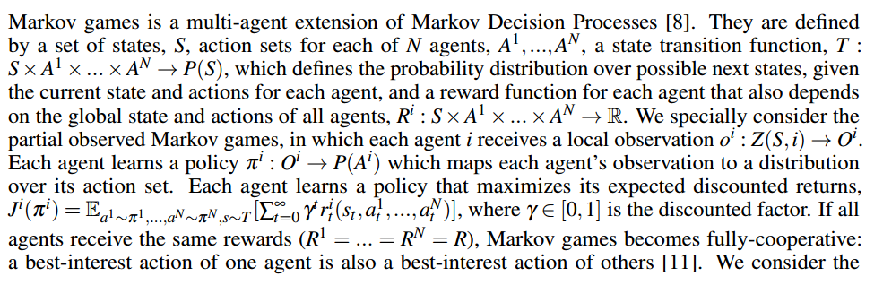
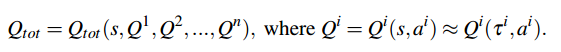
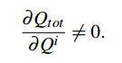
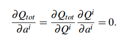
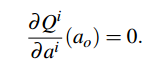
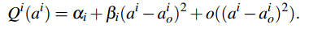
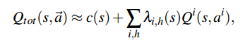
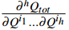
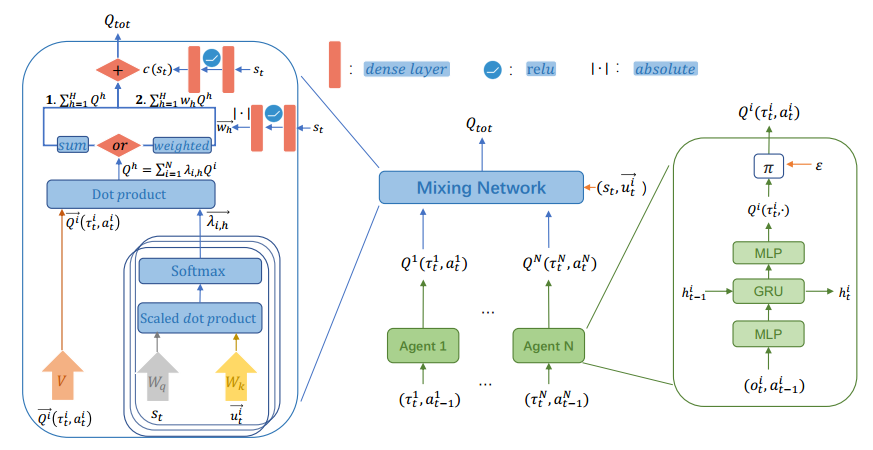

# Qatten
## 研究背景
**挑战**：
- 对于值分解问题，大多数研究在Qtot与Qi之间施加了某些假设，并缺乏理论基础。
- 将个体Qi转换为Qtot时，它们并未明确考虑来自个体的“agent-level impact”对整个系统的影响。

**Qatten**：从理论上推导出Qtot关于Qi的一般公式；并且基于此，使用**多头注意力机制来近似Qtot**，通过agent-level的注意力机制精炼了Qtot的表示。**采用了键值记忆操作，在多头注意力结构内显示衡量每个个体对全局系统的重要性，从而将Qi转化为Qtot**，同时Qatten利用智能体i的动作-观测历史记录ti来替代其观测值oi，并在智能体的局部策略或Q值函数中引入循环神经网络(RNN)。

### 已有研究(值分解)
**VDN**: 假设Qtot与Qi之间存在线性关系，并使用线性回归来估计Qtot,忽略了训练过程中可用的额外状态信息。
**QMIX**：要求Qtot在Qi上单调，使用混合网络隐性地黑箱式Qtot。。此外，在将个体Qi混合到Qtot时，QMIX直接使用由全局特征生成的权重，而不是在个体智能体层面上精确建模个体对整个系统的影响。
**QTRAN**：被提出以确保在继承加法假设的同时，避免由VDN和QMIX引入的表示限制。然而，QTRAN所涉及的优化问题的约束在计算上是难以处理的。作者不得不通过两个惩罚项来放松这些约束，从而使QTRAN偏离了精确解。

#### 马尔科夫博弈
注意到：

可以看到

在马尔科夫博弈中，**状态转移函数 \( T \)** 是环境动态的核心描述，它定义了多个智能体共同动作如何影响环境状态的变化。

##### **1. 基本定义**
状态转移函数 \( T \) 是一个概率分布函数，其数学形式为：  
\[
T: S \times A^1 \times A^2 \times \ldots \times A^N \rightarrow P(S)
\]  
其中：
• **输入**：当前状态 \( s \in S \)，以及所有智能体的联合动作 \( (a^1, a^2, \ldots, a^N) \)（每个 \( a^i \in A^i \)）。
• **输出**：下一状态 \( s' \in S \) 的概率分布 \( P(S) \)，即 \( T(s' \mid s, a^1, a^2, \ldots, a^N) \) 表示在状态 \( s \) 下执行联合动作 \( (a^1, \ldots, a^N) \) 后转移到状态 \( s' \) 的概率。

**核心作用**：\( T \) 决定了环境的动态特性，即多个智能体的动作如何共同改变环境状态。

---
##### **2. 数学表达示例**
假设环中有两个智能体（\( N=2 \)），状态空间 \( S \) 包含位置信息，动作空间 \( A^1 = \{\text{左移}, \text{右移}\} \)，\( A^2 = \{\text{上移}, \text{下移}\} \)。状态转移函数 \( T \) 可能表现为：
\[
T(s' \mid s, a^1=\text{右移}, a^2=\text{下移}) = 
\begin{cases} 
0.8 & \text{若 } s' = \text{智能体1右移、智能体2下移后的新位置} \\
0.2 & \text{若 } s' = \text{其他状态（如碰撞）}
\end{cases}
\]  
这表明，当两个智能体同时执行动作时，环境可能以80%的概率按预期移动，20%的概率因碰撞等原因进入其他状态。
**这意味着，这里提到的T代表了环境是不确定的** ：环境本身的固有属性（如物理随机性），即使智能体完全感知全局状态 s，下一状态仍可能随机变化。

---

### MAS与attention机制结合
**MAAC**:利用自注意力机制，通过有选择性的关注来自其他智能体的信息来学习每个智能体的评价函数；
**TarMAC**:通过“发送者-接受者”软注意力机制与多轮协作推理，实现智能体之间的有针对性持续通信。

---

## Qatten 对Qtot与Qi之间关系的理论分析
首先对于Qtot和Qi,有如下的关系：

对于每一个Qi,都会对Qtot产生正向或负向的影响，这意味着Qtot对Qi的偏导不为0（若等于0，则说明agent i游离在多智能体系统之外，不对Qtot产生任何影响，但是允许偏导数游有零点存在）：

为简化问题，**固定状态s,研究智能体i动作空间中极大指点a0,在此处，Qi关于a0的偏导数为0**，因此Qtot关于a0的偏导数为：
 即

对Qi（ai）进行局部展开，有：
 （αβ均为常数，**a0为极大值点，且一阶偏导为0**）

由此，对于极值点a0附件，有Qtot与Qi的衍生定理一，使Qtot的局部展开有以下形式：

c(s)是依赖于状态s的常数；λi,h(s)是所有h阶偏导数的线性泛化，并随着h呈超指数阶衰减。

## Qatten 方法

## 一些思考总结